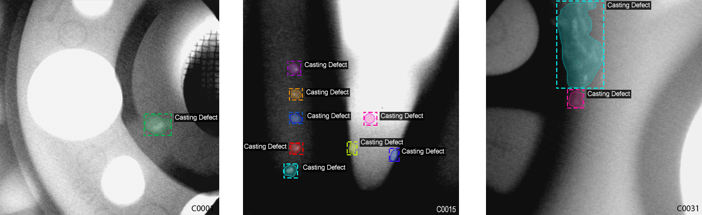

# Detection and Segmentation of Manufacturing Defects using X-Ray Images

This project uses the [Mask R-CNN](https://arxiv.org/abs/1703.06870) framework to automatically detect casting defects in X-Ray images.
The defect detection system is trained and tested on the [GDXray dataset](https://domingomery.ing.puc.cl/material/gdxray/).

- [data_generator.ipynb](/data_generator.ipynb). This notebook contains the tools for segmentation data generation in coco format along with annotation jsons.

- [inspect_data.ipynb](/inspect_data.ipynb). This notebook visualizes the different pre-processing steps
  to prepare the training data. It focuses on simulation of ellipsoidal defects and its mask extraction.

- [inspect_model.ipynb](/inspect_model.ipynb) This notebook goes in depth into the steps performed to detect and segment objects. It provides visualizations of every step of the pipeline.

- [inspect_weights.ipynb](/inspect_weights.ipynb)
  This notebooks inspects the weights of a trained model and looks for anomalies and odd patterns.
